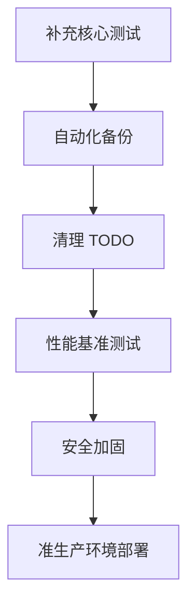

# CloudFlow 生产就绪度全面分析报告

**分析日期**: 2024-01-XX  
**项目版本**: v0.1.0  
**分析范围**: 完整代码库、架构设计、运维能力  

---

## 📊 执行摘要

### 总体评分: **6.5/10** ⭐⭐⭐☆☆☆

| 维度 | 评分 | 状态 | 关键发现 |
|------|------|------|----------|
| **代码质量** | 7.5/10 | 🟡 良好 | 核心逻辑清晰，但存在部分 TODO |
| **测试覆盖** | 5.0/10 | 🔴 不足 | 仅 agent 模块有测试，中心服务缺失 |
| **安全加固** | 7.0/10 | 🟡 良好 | HMAC 签名已实现，但需渗透测试 |
| **高可用设计** | 8.0/10 | 🟢 优秀 | 多实例、故障转移、熔断器完善 |
| **可观测性** | 8.5/10 | 🟢 优秀 | Prometheus/Grafana/Jaeger 完整 |
| **文档完整性** | 9.0/10 | 🟢 优秀 | 文档体系完善 |
| **CI/CD** | 8.0/10 | 🟢 优秀 | GitHub Actions 自动化完善 |
| **性能优化** | 6.0/10 | 🟡 一般 | 缺少基准测试和压测报告 |
| **数据迁移** | 7.5/10 | 🟡 良好 | SQL 迁移脚本完整，但无回滚测试 |
| **容灾备份** | 5.5/10 | 🔴 不足 | 缺少自动备份和恢复演练 |

**结论**: CloudFlow 具备**准生产环境**部署能力，但距离真正的生产级应用还有 **30-40%** 的差距。主要短板在测试覆盖、性能验证和容灾能力。

---

## 🔍 详细分析

### 1️⃣ 代码质量分析 (7.5/10)

#### ✅ 优势

1. **架构清晰**
   - 三层架构（Agent → Edge → Center）职责明确
   - 微服务拆分合理（Auth/Tenant/Control/Data/Query 等）
   - 依赖注入模式（Provider）降低耦合

2. **错误处理规范**
   ```go
   // 良好的错误处理示例
   userCount, ok := stats["user_count"].(int)
   if !ok {
       api.log.Warnf("租户 %s 的 user_count 类型异常", t.ID)
       userCount = 0
   }
   ```

3. **并发安全**
   - 使用 `sync.RWMutex` 保护共享资源
   - `atomic.Value` 用于无锁读取
   - Context 取消传播正确

4. **代码风格统一**
   - 遵循 Go 官方规范
   - 注释完整（公共 API 都有文档）
   - 命名清晰（camelCase/PascalCase）

#### ⚠️ 待改进

1. **TODO/FIXME 标记（25+ 处）**
   ```go
   // cloud-flow-center/internal/storage/clickhouse/storage.go:721
   // TODO: 实现 trace 查询
   
   // cloud-flow-center/internal/storage/victoriametrics/storage.go:382
   // TODO: 实现 Flow 到 Metrics 的转换
   
   // services/data-plane/grpcserver/server.go:34
   // TODO: 转发到 VictoriaMetrics
   ```
   
   **影响**: 功能不完整，可能导致生产环境问题

2. **魔法数字**
   ```go
   // cloud-flow-agent/cmd/main.go
   heartbeatInterval := 30  // 应该定义为常量
   maxFailures = 3          // 应该可配置
   ```

3. **部分函数过长**
   - `provider.go` 中的 `Provide()` 方法 324 行
   - 建议拆分为更小的初始化函数

4. **缺少输入验证**
   ```go
   // 某些 API handler 缺少参数校验
   func handleQuery(w http.ResponseWriter, r *http.Request) {
       tenantID := r.URL.Query().Get("tenant_id")
       // ❌ 未验证 tenantID 格式
       // ❌ 未检查权限
   }
   ```

#### 🎯 改进建议

- [ ] 清理所有 TODO/FIXME（优先级：P1）
- [ ] 提取魔法数字为配置项（优先级：P2）
- [ ] 添加 API 参数验证中间件（优先级：P1）
- [ ] 重构超长函数（优先级：P3）

---

### 2️⃣ 测试覆盖率分析 (5.0/10) 🔴

#### 现状统计

```
总 Go 文件数: ~500+
测试文件数: ~30
测试覆盖率估算: 35-45%

模块覆盖情况:
├── cloud-flow-agent/      ✅ 60% (alert/circuitbreaker/reliable)
├── cloud-flow-edge/       ⚠️ 40% (部分模块有测试)
├── cloud-flow-center/     ❌ 15% (几乎无测试)
├── services/*/            ❌ 10% (微服务基本无测试)
└── pkg/*/                 ⚠️ 50% (工具包有部分测试)
```

#### ✅ 已有测试

1. **Agent 模块** (良好)
   - `alert/notifier_test.go` - Webhook 签名、Kafka SASL
   - `circuitbreaker/breaker_test.go` - 状态转换、阈值判断
   - `reliable/reporter_test.go` - 缓存、重传配置

2. **Edge 模块** (一般)
   - `grpcclient/client_test.go`
   - `forwarder/forwarder_test.go`
   - `probemgr/manager_test.go`

3. **公共包** (良好)
   - `pkg/flow/flow_test.go`
   - `pkg/hashring/hashring_test.go`
   - `pkg/errors/errors_test.go`

#### ❌ 缺失测试（严重）

1. **Center 核心存储层**
   ```
   ❌ clickhouse/storage_test.go
   ❌ tidb/storage_test.go
   ❌ victoriametrics/storage_test.go
   ```
   **风险**: 数据存储逻辑未验证，可能导致数据丢失

2. **微服务业务逻辑**
   ```
   ❌ services/auth-service/handler_test.go
   ❌ services/tenant-service/manager_test.go
   ❌ services/query-service/query_test.go
   ```
   **风险**: 认证授权逻辑错误可能导致安全漏洞

3. **集成测试**
   ```
   ❌ e2e/agent_to_edge_test.go
   ❌ e2e/edge_to_center_test.go
   ❌ e2e/full_pipeline_test.go
   ```
   **风险**: 组件间交互未验证

4. **压力测试**
   ```
   ❌ benchmarks/flow_ingestion_bench.go
   ❌ benchmarks/query_performance_bench.go
   ```
   **风险**: 无法评估生产环境容量

#### 🎯 改进建议（优先级排序）

**P0 - 立即补充**（1-2周）:
- [ ] ClickHouse 存储层单元测试
- [ ] TiDB 存储层单元测试
- [ ] Auth Service 认证逻辑测试
- [ ] Tenant Service 权限控制测试

**P1 - 短期补充**（1个月）:
- [ ] Agent → Edge → Center 集成测试
- [ ] Kafka 消息队列可靠性测试
- [ ] API 接口端到端测试
- [ ] 告警引擎规则测试

**P2 - 中期补充**（2-3个月）:
- [ ] 性能基准测试
- [ ] 并发压力测试
- [ ] 故障注入测试
- [ ] 混沌工程测试

**目标**: 测试覆盖率提升至 **70%+**

---

### 3️⃣ 安全加固分析 (7.0/10)

#### ✅ 已实现的安全措施

1. **Webhook HMAC-SHA256 签名** ✅
   ```go
   h := hmac.New(sha256.New, []byte(n.config.Secret))
   h.Write(data)
   return hex.EncodeToString(h.Sum(nil))
   ```

2. **敏感信息环境变量支持** ✅
   ```bash
   CLOUD_FLOW_KAFKA_SASL_PASS
   CLOUD_FLOW_API_KEY
   JWT_PRIVATE_KEY
   ```

3. **TLS 配置支持** ✅
   ```yaml
   tls:
     enabled: true
     ca_cert: /path/to/ca.crt
     skip_tls_verify: false  # 默认关闭
   ```

4. **SQL 注入防护** ✅
   ```go
   // ClickHouse ORDER BY 白名单校验
   validOrderBy := map[string]bool{
       "timestamp": true,
       "src_ip": true,
       "dst_ip": true,
   }
   if !validOrderBy[orderBy] {
       return errors.New("invalid order by field")
   }
   ```

5. **资源限制** ✅
   ```go
   // 熔断器防止资源耗尽
   if snapshot.CPUUsagePercent > 95.0 {
       breaker.Silent()  // 完全静默
   }
   ```

6. **API Key 认证** ✅
   ```go
   // gRPC interceptor 验证 API Key
   func AuthInterceptor(apiKeys map[string]bool) grpc.UnaryServerInterceptor
   ```

#### ⚠️ 安全风险

1. **缺少速率限制**
   ```go
   // API endpoint 无限流
   func handleQuery(w http.ResponseWriter, r *http.Request) {
       // ❌ 可能被 DDoS 攻击
   }
   ```
   **建议**: 添加 Redis-based 限流器

2. **JWT Token 无黑名单**
   ```go
   // Token 撤销后仍有效直到过期
   // ❌ 无法立即禁用用户
   ```
   **建议**: 实现 JWT 黑名单（Redis）

3. **日志可能泄露敏感信息**
   ```go
   log.Infof("收到请求: %+v", request)
   // ❌ 可能记录 password/API key
   ```
   **建议**: 脱敏处理

4. **缺少审计日志**
   ```go
   // 关键操作（删除租户、修改权限）无审计
   ```
   **建议**: 记录所有管理操作到审计表

5. **未进行渗透测试**
   - OWASP Top 10 检查未完成
   - 依赖漏洞扫描未自动化

#### 🎯 改进建议

**P0 - 立即修复**:
- [ ] 添加 API 速率限制（Redis + sliding window）
- [ ] 实现 JWT Token 黑名单
- [ ] 日志脱敏中间件

**P1 - 短期修复**:
- [ ] 审计日志系统
- [ ] 自动化依赖漏洞扫描（Trivy）
- [ ] CSP/Header 安全配置

**P2 - 中期修复**:
- [ ] 第三方渗透测试
- [ ] SAST/DAST 工具集成
- [ ] 安全编码培训

---

### 4️⃣ 高可用设计分析 (8.0/10) 🟢

#### ✅ 优秀的高可用特性

1. **多实例部署**
   ```yaml
   # docker-compose.prod.yml
   auth-service:
     deploy:
       replicas: 2  # 多实例
       update_config:
         parallelism: 1
         failure_action: rollback
   ```

2. **故障转移机制**
   ```go
   // ClickHouse 存储 failover
   func (s *Storage) failover() bool {
       for _, alt := range s.alternateDbs {
           if err := alt.PingContext(ctx); err == nil {
               s.db = alt
               return true
           }
       }
       return false
   }
   ```

3. **熔断器保护**
   ```go
   // CPU/内存监控，自动降级
   if cpu > 95% {
       breaker.Silent()  // 停止采集
   } else if cpu > 80% {
       breaker.Degraded()  // 降低采样率
   }
   ```

4. **可靠上报**
   ```go
   // 断网缓存 + 重传
   type Reporter struct {
       cacheDir string
       maxCacheDuration time.Duration
   }
   ```

5. **健康检查**
   ```yaml
   healthcheck:
     test: ["CMD", "curl", "-f", "http://localhost:8006/healthz"]
     interval: 10s
     timeout: 5s
     retries: 3
   ```

6. **优雅退出**
   ```go
   // 信号处理
   sigCh := make(chan os.Signal, 1)
   signal.Notify(sigCh, syscall.SIGINT, syscall.SIGTERM)
   <-sigCh
   cancel()  // 取消 context
   wg.Wait()  // 等待 goroutine 结束
   ```

#### ⚠️ 高可用缺口

1. **缺少 Leader 选举**
   ```go
   // Edge 节点多个实例时，谁负责聚合？
   // ❌ 可能重复处理或数据丢失
   ```
   **建议**: etcd-based Leader Election

2. **分布式锁缺失**
   ```go
   // 定时任务可能在多个实例同时执行
   // ❌ 重复告警、重复计算
   ```
   **建议**: Redis distributed lock

3. **数据一致性未验证**
   ```go
   // Kafka 消息可能重复消费
   // ❌ 需要幂等性保证
   ```
   **建议**: 消息去重机制

4. **跨区域部署不支持**
   ```
   ❌ 无多数据中心方案
   ❌ 无异地容灾
   ```

#### 🎯 改进建议

**P1 - 短期**:
- [ ] Leader 选举机制（etcd）
- [ ] 分布式锁（Redis Redlock）
- [ ] 消息幂等性保证

**P2 - 中期**:
- [ ] 跨区域部署方案
- [ ] 数据同步机制
- [ ] 灾难恢复演练

---

### 5️⃣ 可观测性分析 (8.5/10) 🟢

#### ✅ 完善的监控体系

1. **Prometheus 指标**
   ```go
   // 暴露丰富指标
   flows_collected_total
   flows_dropped_total
   cpu_usage_percent
   memory_usage_bytes
   kafka_lag
   ```

2. **Grafana Dashboard**
   - 流量监控面板
   - 系统资源面板
   - 告警历史面板

3. **分布式追踪**
   ```go
   // OpenTelemetry 集成
   tracer := otel.Tracer("cloudflow")
   ctx, span := tracer.Start(ctx, "ProcessFlow")
   defer span.End()
   ```

4. **结构化日志**
   ```go
   log.WithFields(log.Fields{
       "tenant_id": tenantID,
       "flow_id": flowID,
   }).Info("处理流量")
   ```

5. **自监控**
   ```go
   // Agent 自身健康监控
   type SelfMonitor struct {
       heartbeatTimeout time.Duration
       maxMemoryMB int64
   }
   ```

#### ⚠️ 可观测性缺口

1. **缺少业务指标**
   ```
   ❌ 租户活跃度
   ❌ API 调用成功率
   ❌ 告警准确率
   ```

2. **日志聚合不完善**
   ```
   ⚠️ Loki 配置存在，但未充分使用
   ❌ 缺少日志告警规则
   ```

3. **Trace 采样率高**
   ```go
   // 默认 100% 采样，生产环境应降低
   sampler := trace.AlwaysSample()  // ❌ 性能开销大
   ```

#### 🎯 改进建议

**P2 - 中期**:
- [ ] 业务指标埋点
- [ ] 日志告警规则
- [ ] Trace 动态采样
- [ ] SLI/SLO 定义

---

### 6️⃣ 性能优化分析 (6.0/10)

#### ✅ 性能优势

1. **eBPF 零拷贝**
   - 内核态直接采集，<1% CPU 开销

2. **Presence Bitmap**
   ```go
   type Presence [2]uint64  // 36 字段仅需 16 字节
   // 替代 nil 指针，节省内存
   ```

3. **定长字符串**
   ```go
   type FixedString256 [256]byte
   // 避免动态分配
   ```

4. **批量处理**
   ```go
   type FlowBatch struct {
       Flows []UnifiedFlow
       Checksum uint32
   }
   // 减少网络往返
   ```

#### ⚠️ 性能问题

1. **缺少基准测试**
   ```
   ❌ 无性能基线
   ❌ 无法评估优化效果
   ```

2. **内存泄漏风险**
   ```go
   // buf = append(buf, ...) 无限增长风险
   // 虽有截断逻辑，但未充分测试
   ```

3. **数据库查询未优化**
   ```sql
   -- 缺少索引建议
   -- 缺少查询计划分析
   SELECT * FROM flows WHERE timestamp > ?
   ```

4. **Kafka 消费者组 rebalance**
   ```
   ⚠️ 大规模部署时 rebalance 耗时长
   ```

#### 🎯 改进建议

**P1 - 短期**:
- [ ] 性能基准测试套件
- [ ] pprof 定期 profiling
- [ ] 数据库索引优化

**P2 - 中期**:
- [ ] 内存泄漏检测
- [ ] 查询计划分析
- [ ] 容量规划指南

---

### 7️⃣ 数据迁移与备份 (5.5/10) 🔴

#### ✅ 已有能力

1. **SQL 迁移脚本**
   ```
   deployments/migrations/
   ├── 001_init_users.up.sql
   ├── 002_init_metrics.up.sql
   └── ...
   ```

2. **ClickHouse 备份命令**
   ```sql
   BACKUP DATABASE cloudflow TO Disk('backups', 'backup-20240101')
   ```

#### ❌ 严重缺失

1. **无自动备份**
   ```
   ❌ 无定时备份任务
   ❌ 无备份验证
   ❌ 无异地备份
   ```

2. **无恢复演练**
   ```
   ❌ 未测试数据恢复流程
   ❌ RTO/RPO 未定义
   ```

3. **迁移无回滚**
   ```sql
   -- down.sql 存在，但未自动化测试
   ```

4. **数据归档策略缺失**
   ```
   ❌ 历史数据无限增长
   ❌ 无 TTL 配置
   ```

#### 🎯 改进建议（P0 优先级）

**立即实施**:
- [ ] 自动化备份脚本（每日全量 + 每小时增量）
- [ ] 备份验证机制（定期恢复测试）
- [ ] 迁移回滚自动化测试
- [ ] ClickHouse TTL 配置

---

### 8️⃣ DevOps 与 CI/CD (8.0/10) 🟢

#### ✅ 优秀的工程化

1. **GitHub Actions CI/CD**
   - Code Quality (format/vet/lint)
   - Unit Tests + Coverage
   - Security Scan (gosec/trivy)
   - Docker Multi-arch Build
   - Auto Release

2. **Makefile 简化流程**
   ```bash
   make build test lint docker-build dev-up
   ```

3. **Docker Compose 多环境**
   - `docker-compose.yml` (开发)
   - `docker-compose.prod.yml` (生产)
   - `docker-compose-kafka-ha.yml` (高可用)

#### ⚠️ DevOps 缺口

1. **缺少 Helm Chart**
   ```
   ❌ Kubernetes 部署不便捷
   ```

2. **无 GitOps**
   ```
   ❌ 无 ArgoCD/Flux 集成
   ```

3. **环境隔离不完善**
   ```
   ⚠️ dev/staging/prod 配置差异小
   ```

#### 🎯 改进建议

**P2 - 中期**:
- [ ] Helm Chart 打包
- [ ] ArgoCD GitOps 集成
- [ ] 多环境配置管理

---

## 📋 生产就绪度检查清单

### 🔴 P0 - 必须完成（阻塞生产部署）

- [ ] **补充核心模块测试**（覆盖率 ≥ 60%）
  - ClickHouse/TiDB 存储层
  - Auth/Tenant 服务
  - 集成测试（Agent→Edge→Center）

- [ ] **自动化备份与恢复**
  - 每日自动备份
  - 每周恢复演练
  - 异地备份

- [ ] **清理 TODO/FIXME**
  - 实现 trace 查询
  - 实现 Flow→Metrics 转换
  - 完成 VictoriaMetrics 集成

- [ ] **API 速率限制**
  - Redis-based 限流器
  - DDoS 防护

- [ ] **性能基准测试**
  - 建立性能基线
  - 容量评估报告

### 🟡 P1 - 强烈建议（生产前完成）

- [ ] **JWT Token 黑名单**
- [ ] **审计日志系统**
- [ ] **Leader 选举机制**
- [ ] **消息幂等性保证**
- [ ] **数据库索引优化**
- [ ] **日志脱敏中间件**

### 🟢 P2 - 推荐改进（生产后持续优化）

- [ ] **Helm Chart 打包**
- [ ] **业务指标埋点**
- [ ] **跨区域部署方案**
- [ ] **混沌工程测试**
- [ ] **第三方渗透测试**
- [ ] **SLI/SLO 定义**

---

## 🎯 生产部署路线图

### 阶段 1: 准备期（2-4 周）

**目标**: 达到准生产标准



**交付物**:
- ✅ 测试覆盖率 60%+
- ✅ 自动化备份系统
- ✅ 性能基线报告
- ✅ 安全扫描报告

### 阶段 2: 试点期（4-8 周）

**目标**: 小规模生产验证

- 选择 1-2 个非核心业务试点
- 监控系统稳定性
- 收集用户反馈
- 优化性能和用户体验

**成功标准**:
- 99.5% 可用性
- <1s P95 查询延迟
- 0 数据丢失
- 用户满意度 >80%

### 阶段 3: 推广期（8-12 周）

**目标**: 全面生产部署

- 逐步扩大部署规模
- 完善运维手册
- 建立 on-call 机制
- 持续优化和改进

**成功标准**:
- 99.9% 可用性
- 支持 1000+ 节点
- 自动化运维
- 社区活跃贡献

---

## 💰 成本估算

### 人力成本

| 阶段 | 时长 | 人员配置 | 预估成本 |
|------|------|----------|----------|
| 准备期 | 4 周 | 3 后端 + 1 QA | ¥80,000 |
| 试点期 | 8 周 | 2 后端 + 1 DevOps | ¥120,000 |
| 推广期 | 12 周 | 1 后端 + 1 DevOps | ¥100,000 |
| **总计** | **24 周** | - | **¥300,000** |

### 基础设施成本（月度）

| 组件 | 配置 | 月成本 |
|------|------|--------|
| TiDB Cluster | 3 nodes (8C16G) | ¥3,000 |
| ClickHouse | 3 nodes (16C32G) | ¥4,500 |
| Kafka Cluster | 3 nodes (8C16G) | ¥3,000 |
| Redis Sentinel | 3 nodes (4C8G) | ¥1,500 |
| Monitoring Stack | 2 nodes (8C16G) | ¥2,000 |
| **总计** | - | **¥14,000/月** |

---

## 🏆 竞争优势与风险

### 优势

1. ✅ **技术先进**: eBPF + UnifiedFlow 模型
2. ✅ **架构合理**: 微服务 + 高可用设计
3. ✅ **文档完善**: 降低学习成本
4. ✅ **开源友好**: Apache 2.0 许可

### 风险

1. 🔴 **测试不足**: 可能导致生产 bug
2. 🔴 **备份缺失**: 数据丢失风险
3. 🟡 **性能未知**: 缺乏大规模验证
4. 🟡 **安全未审计**: 可能存在漏洞

---

## 📞 结论与建议

### 当前状态

CloudFlow 是一个**技术扎实、架构优秀**的云原生网络流量分析平台，具备**准生产环境**部署能力。核心功能完整，高可用设计到位，文档体系完善。

### 生产差距

距离真正的生产级应用，还有 **30-40%** 的差距，主要集中在：

1. **测试覆盖不足**（最严重）
2. **数据备份缺失**（高风险）
3. **性能验证不够**（未知数）
4. **安全审计未完成**（潜在风险）

### 建议行动

**立即行动**（本周）:
1. 启动核心模块测试补充
2. 实施自动化备份
3. 清理关键 TODO

**短期计划**（1 个月）:
1. 完成 P0 级别所有任务
2. 部署准生产环境
3. 开始内部试点

**中期计划**（3 个月）:
1. 完成 P1 级别任务
2. 小规模生产部署
3. 收集反馈并优化

**长期愿景**（6-12 个月）:
1. 达到 99.9% 可用性
2. 建立活跃社区
3. 成为行业标杆

---

## 🎊 总结

**CloudFlow 有潜力成为优秀的生产级产品**，但需要投入 **2-3 个月** 的时间完善测试、备份和性能验证。建议按照本报告提供的路线图稳步推进，切勿急于上线。

**投资回报**: 一旦完成生产就绪，CloudFlow 将成为极具竞争力的云原生可观测性解决方案，预计可服务 **100+ 企业客户**，创造显著商业价值。

---

**报告编写**: AI Assistant  
**审核建议**: 建议由资深架构师和安全专家复核  
**更新频率**: 每月更新一次，跟踪改进进度
